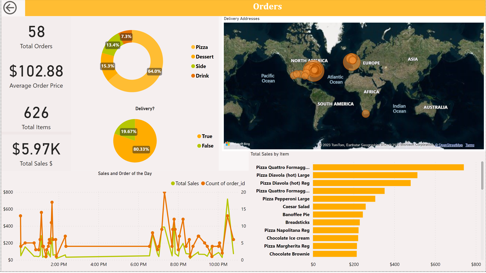
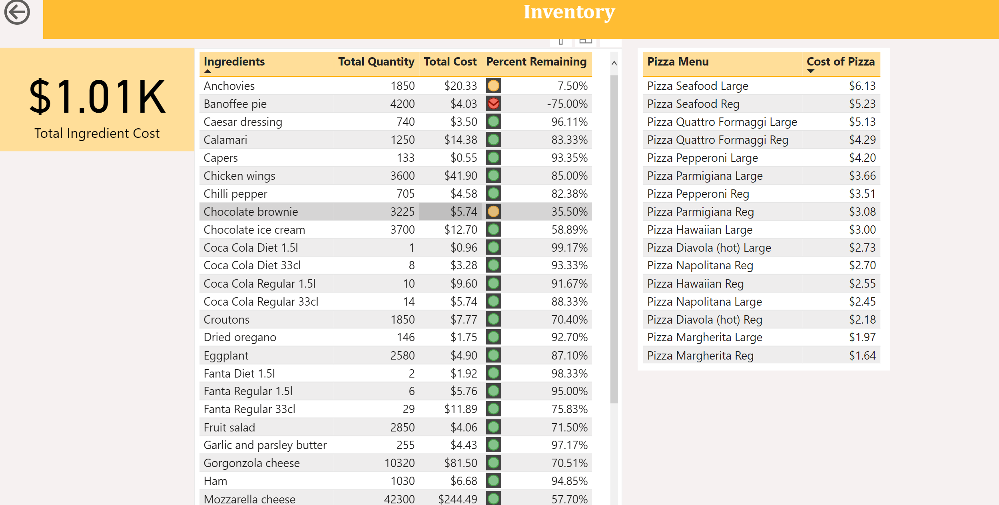

# Elroi-Pizzeria

## Project Overview
This project involves the development and implementation of a comprehensive database system and an interactive dashboard for **Elroi Pizzeria**, a pizza restaurant specializing in delivery and pick-up services. The primary goal of this project is to efficiently capture and manage essential business data, facilitating the monitoring and analysis of key metrics through an interactive dashboard.
Project Scope
The project encompasses three main aspects as outlined in the client's project brief:
1. Customer Orders
Initially comprising 5 primary fields, this section was later expanded to include 13 fields through a normalization process. The objective is to record and analyze customer orders, including various aspects such as order totals, sales, items, order value averages, sales by category, top-selling items, orders by hour, orders by address, sales by hours, and orders by delivery/pickup.
2. Inventory Control
The client requires a mechanism to determine when to replenish inventory. This involves monitoring inventory usage and identifying items that require reordering.
3. Staff/Employees
The staff module involves tracking employee work schedules and, based on employee salary information, calculating the cost of producing each pizza.
Project Implementation
The project was divided into the following key phases:
## Building the SQL Database
In this phase, we created the relational database and defined the necessary tables. The following steps were taken:
-	Designing the Database and Tables: Careful consideration was given to designing a schema that accommodates all the required data fields efficiently.
-	Normalizing the Generated Data: The data was normalized to optimize data integrity and reduce redundancy.
-	Defining Relationships: Relationships between the tables were established to ensure data consistency and facilitate efficient queries.
## Writing Custom Queries
Custom SQL queries were developed to meet the specific requirements of the client in the three key areas:
1. Customer Orders:
**Queries:** A SQL query was crafted using JOIN functions to amalgamate data from multiple tables. This query allows us to obtain the data view necessary to create the initial dashboard and satisfy the customer's needs. The SQL query was used to answer the following:
-	Calculation of total orders, sales, and items.
-	Determination of average order value.
-	Analysis of sales by category.
-	Identification of top-selling items.
-	Segmentation of orders by hour, address, and delivery/pickup.
2. Inventory Management:
**Queries:** For the Inventory Management section, we have implemented multiple views and queries to ensure efficient stock management. In the first view, we make use of aggregate functions, GROUP BY clauses, JOIN operations, and sub-queries to calculate the necessary metrics for the inventory management dashboard. In the second view, we build upon the first view, employing additional aggregate functions, GROUP BY clauses, and JOIN operations to achieve a comprehensive understanding of inventory usage and reordering needs. This will include:
-	Utilization of multiple views to calculate inventory usage.
-	Identification of items requiring reordering.
3. Staff Managment:
**Queries:** To meet the client's request in the Staff module, we combined data from three different tables. Utilizing a combination of aggregate functions, JOIN operations, and datetime functions, we successfully calculated the individual production costs for each pizza made by staff members. This valuable information allows the client to manage costs and make informed decisions regarding staffing.
-	Integration of data from three tables.
-	Use of aggregate functions, joins, and datetime functions to calculate individual pizza production costs for each staff member.
## Building an Interactive Dashboard
An interactive dashboard was created to visualize and present the data insights using the views created in our code. New measures were created using SUMx,CONCATENATEX,DIVIDE measurments to fullfil all the requirments.The dashboard offers a user-friendly interface for monitoring and analyzing the information captured in the database.

                   

[Link to Dashboard](https://app.powerbi.com/links/BbsesK0xA9?ctid=cbb8585a-58be-4c67-a9e8-aa46ea967bb1&pbi_source=linkShare)

**Conclusion**
This project has successfully met the client's requirements by providing an efficient and well-designed database system along with an interactive dashboard. The custom queries enable the extraction of valuable insights, and the dashboard offers an intuitive platform for monitoring and decision-making.
